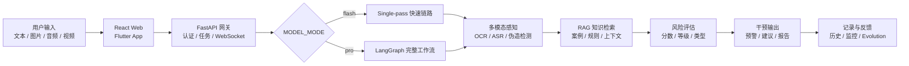

<div align="center">

# 反诈预警专家系统

面向电信网络诈骗场景的多模态风险识别与预警平台，支持文本、图片、音频、视频输入，并提供快速版 Flash 与完整工作流版 Pro 两种运行模式。

[](https://www.python.org/)
[](https://fastapi.tiangolo.com/)
[](https://react.dev/)
[](https://flutter.dev/)
[](https://www.langchain.com/langgraph)

</div>

## 目录

- [项目简介](#项目简介)
- [运行版本](#运行版本)
- [核心能力](#核心能力)
- [系统架构](#系统架构)
- [项目结构](#项目结构)
- [快速开始](#快速开始)
- [常用接口](#常用接口)
- [配置说明](#配置说明)
- [开发建议](#开发建议)
- [常见问题](#常见问题)

## 项目简介

本项目是一个反诈检测与预警系统，后端基于 `FastAPI`，Web 端基于 `React + TypeScript + Vite`，移动端基于 `Flutter`，核心检测链路结合了多模态感知、RAG 知识检索、用户画像、风险评估和大模型报告生成。

系统当前重点支持两种运行版本：

- `flash`：默认快速版，低延迟、单轮分析，适合演示和日常联调。
- `pro`：完整工作流版，走 LangGraph 多步骤链路，适合展示完整架构和调试复杂流程。

## 运行版本

通过后端环境变量 `MODEL_MODE` 选择运行版本。

| 版本 | 配置值 | 链路定位 | 推荐场景 |
| --- | --- | --- | --- |
| Flash | `MODEL_MODE=flash` | 单轮 single-pass 快速分析链路，当前默认版本 | 本地演示、低延迟交互、Web/移动端联调 |
| Pro | `MODEL_MODE=pro` | LangGraph 多步骤完整工作流，保留原完整链路 | 完整架构展示、节点调试、RAG/画像/监护链路验证 |

兼容说明：旧配置 `MODEL_MODE=unified` 会按 `pro` 处理；未配置或配置非法时默认回退到 `flash`。

### Flash

Flash 版本强调快速返回可执行结论：

- 支持文本、图片、音频、视频输入。
- 走 single-pass 分析路径。
- 会先做必要的媒体感知和轻量预警信息收集，再交给大模型生成结果。
- 报告更短、更直接，优先输出风险结论、关键线索和立即操作。
- 更适合课堂演示、答辩演示、本地调试和资源较紧张的环境。

```env
MODEL_MODE=flash
```

### Pro

Pro 版本强调流程完整性和可扩展编排：

- 走 LangGraph 多步骤工作流。
- 按 PDIE 思路组织：感知、决策、干预、演进。
- 更适合验证完整节点链路、RAG/规则/画像融合、监护联动和反馈学习。
- 结果更偏结构化和完整性，但响应时延通常高于 Flash。

```env
MODEL_MODE=pro
```

## 核心能力

| 能力 | 说明 |
| --- | --- |
| 多模态输入 | 支持文本、图片、音频、视频检测 |
| 媒体感知 | OCR、ASR、图片/音视频伪造检测、视频关键帧分析 |
| RAG 检索 | 基于本地反诈案例与知识库提供风险判断上下文 |
| 风险识别 | 输出风险分数、风险等级、诈骗类型、告警信息和结构化报告 |
| 用户画像 | 结合用户角色、历史风险记录、联系人/监护人信息做个性化判断 |
| 异步任务 | 支持后台检测、轮询查询和 WebSocket 进度推送 |
| 监护联动 | 保留监护通知编排接口，默认返回 `provider_not_bound`，不阻塞检测链路 |
| 双前端 | 同时提供 React Web 端和 Flutter 移动端 |

## 系统架构



## 项目结构

```text
.
├── backend/                 # FastAPI 后端，认证、检测、任务、监控、Agent 接口
│   ├── api/                 # API 路由
│   ├── graph_core/          # LangGraph 客户端、任务管理、异常封装
│   ├── schemas/             # 请求/响应模型
│   ├── app.py               # 后端入口
│   ├── auth.py              # JWT 认证工具
│   └── database.py          # SQLAlchemy 模型和数据库初始化
├── frontend/                # React + TypeScript + Vite Web 前端
│   └── src/
├── anti_fraud_app/          # Flutter 移动端
│   └── lib/
├── src/                     # LangGraph 与反诈核心逻辑
│   ├── perception/          # 多模态感知层
│   ├── brain/               # 意图识别、RAG、风险评估
│   ├── action/              # 预警、报告、监护通知
│   ├── evolution/           # 运行记录、反馈、监控
│   ├── graphs/              # 工作流节点和图编排
│   └── storage/             # 记忆与存储
├── multimodal_input/        # OCR、音频、视频等底层多模态模块
├── config/                  # RAG、LLM、风险评估、报告生成配置
├── test/                    # 集成测试和 RAG 测试
├── requirements.txt         # 根 Python 依赖
├── run_system.py            # 多服务统一启动/测试脚本
└── .env.example             # 环境变量示例
```

## 快速开始

### 环境要求

| 依赖 | 版本/说明 |
| --- | --- |
| Python | 3.10+ |
| Node.js | 18+ |
| npm | 9+ |
| Flutter SDK | 仅移动端需要 |
| FFmpeg | 音频/视频处理建议安装 |
| LLM 服务 | OpenAI 兼容接口或本地 Ollama 兼容接口 |

## 环境变量

在仓库根目录复制环境变量文件：

```powershell
Copy-Item .env.example .env
```

至少确认以下配置：

```env
SECRET_KEY=replace-with-random-secret
LLM_API_KEY=your_llm_api_key
LLM_BASE_URL=http://127.0.0.1:11434/v1
LLM_MODEL=gemma4:e2b
MODEL_MODE=flash
```

如使用云端 OpenAI 兼容服务，可改为：

```env
LLM_API_KEY=your_api_key
LLM_BASE_URL=https://dashscope.aliyuncs.com/compatible-mode/v1
LLM_MODEL=qwen3-vl-32b-thinking
MODEL_MODE=flash
```

### 2. 启动后端

```powershell
python -m venv .venv
.\.venv\Scripts\Activate.ps1
pip install -r requirements.txt
python backend/app.py
```

启动后访问：

| 服务 | 地址 |
| --- | --- |
| API 文档 | http://localhost:8000/docs |
| 健康检查 | http://localhost:8000/health |

### 3. 启动 Web 前端

```powershell
cd frontend
npm install
npm run dev
```

默认地址：

| 服务 | 地址 |
| --- | --- |
| Web 前端 | http://localhost:5173 |
| 后端 API | http://localhost:8000 |

如需显式配置前端 API 地址，可创建 `frontend/.env`：

```env
VITE_API_URL=http://localhost:8000
```

### 4. 启动 Flutter 移动端

```powershell
cd anti_fraud_app
flutter pub get
flutter run
```

移动端常见 API 地址：

```env
API_BASE_URL=http://10.0.2.2:8000
```

Android 模拟器访问宿主机通常使用 `10.0.2.2`，iOS 模拟器通常可使用 `localhost`。

## 常用接口

### 认证

```text
POST /api/auth/register
POST /api/auth/login
GET  /api/auth/me
```

```text
POST /api/fraud/detect
POST /api/fraud/detect-async
GET  /api/fraud/tasks/{task_id}
GET  /api/fraud/ws/tasks/{task_id}?token=...
GET  /api/fraud/history
POST /api/fraud/feedback
```

### Agent 与用户数据

```text
POST /api/agent/chat
GET  /api/agent/conversation/{conversation_id}
GET  /api/contacts/
POST /api/contacts/
GET  /api/settings/profile
PUT  /api/settings/profile
```

### 监控

```text
GET  /api/monitor/
GET  /api/monitor/health
GET  /api/monitor/metrics
GET  /api/monitor/alerts
POST /api/monitor/alerts/test
```

## 配置说明

### 检测输入

检测接口使用 `multipart/form-data`：

| 字段 | 必填 | 说明 |
| --- | --- | --- |
| `message` | 是 | 用户输入文本 |
| `audio_file` | 否 | 音频文件 |
| `image_file` | 否 | 图片文件 |
| `video_file` | 否 | 视频文件 |
| `client_request_started_at_ms` | 否 | 前端埋点时间，用于性能统计 |

Web 前端支持把本地图片、音频、视频拖入聊天输入区。同一类型文件通常只保留一个用于当前检测。

### RAG

后端启动时会初始化数据库，并按配置检查/构建 RAG 知识库：

```env
RAG_AUTO_BUILD=true
RAG_FORCE_REBUILD=false
RAG_CONFIG_PATH=config/rag.yaml
```

首次构建较慢时，可在只做前后端联调的场景临时关闭：

```env
RAG_AUTO_BUILD=false
```

### OCR 与多模态

```env
OCR_ENABLE_MKLDNN=false
OCR_CPU_THREADS=4
```

注意事项：

- OCR 默认使用 CPU 版 Paddle 相关依赖，Windows 下通常建议关闭 MKLDNN。
- 音频伪造检测和视频伪造检测依赖 `multimodal_input` 下的权重文件。
- 权重缺失时服务仍可启动，但对应能力会降级或不可用。
- 图片链路会参考 AI 伪造概率，高风险时可能优先返回风险判断，以减少等待 OCR 的时间。
- 本地 Ollama 兼容接口可通过 `LLM_BASE_URL=http://127.0.0.1:11434/v1` 接入。

## 开发建议

- 默认使用 `MODEL_MODE=flash` 做前后端联调，响应更快，问题更容易定位。
- 调试完整工作流、记忆、RAG 节点时切换到 `MODEL_MODE=pro`。
- 数据库、RAG 索引、前端构建产物、模型权重和日志属于运行产物，通常不应提交。
- 新增 API 时优先复用 `schemas.response` 中的统一响应结构。
- 异步检测建议同时保留 WebSocket 和轮询路径，避免推送中断影响前端体验。

## 常见问题

### 切换版本后没有生效

确认修改的是后端实际读取的 `.env`，然后重启：

```powershell
python backend/app.py
```

### 前端 401 或无法检测

先确认已注册/登录，再检查浏览器本地 token 是否存在。后端检测接口需要认证。

### WebSocket 没有进度

检查请求地址是否为：

```text
/api/fraud/ws/tasks/{task_id}?token=...
```

同时确认 token 有效。前端应保留轮询兜底。

### RAG 构建很慢

首次启动可能会构建知识库。已有可用索引时会跳过；只想快速联调时可设置：

```env
RAG_AUTO_BUILD=false
```

## 许可证

本项目仅供学习、研究与演示使用。
